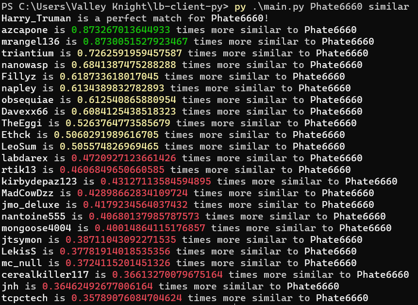
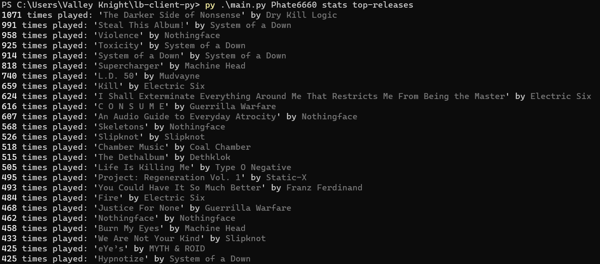
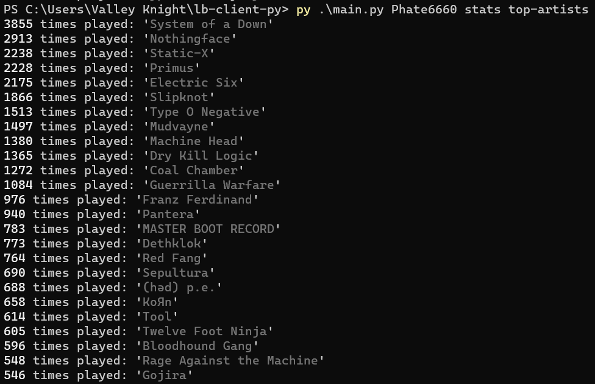

# lb-client-py

This project is a WIP ListenBrainz API client.

CLI Args:

- The first is a username

- The second is the operation (currently supported is `current`, `count`, `listens`, `similar`, `stats`)

`current` is the currently playing song.

`count` is the total song count.

`listens` is for showing recent listens:

- By default, it will show as many as possible.

- Or you can optionally specify a count of listens to show.

`similar` shows users similar to the specified one.

`stats` has some sub operations:

- `artist-map` to display how many artists were played from different countries

- `top-artists`, `top-releases`, and `top-tracks` which are self-explanatory

Example outputs:

- current:


- count:

```
$ py .\main.py Phate6660 count
Phate6660 has listened to 55322 tracks.
```

- listens:


- similar:



- stats:




