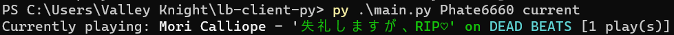
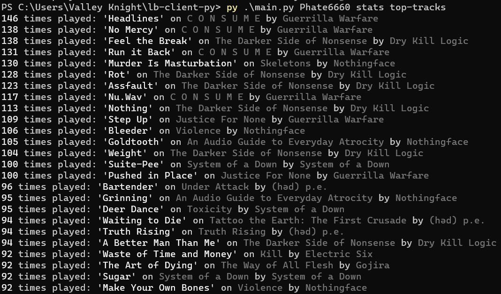

# lb-client-py

This project is a WIP ListenBrainz API client.

CLI Args:

- The first is a username

- The second is the operation (currently supported is `current`, `count`, `stats`)

`current` is the currently playing song.

`count` is the total song count.

`stats` has some sub operations:

- `artist-map` to display how many artists were played from different countries

- `top-artists`, `top-releases`, and `top-tracks` which are self-explanatory

Example outputs:

- current:



- count:

```
$ py .\main.py Phate6660 count
Phate6660 has listened to 55322 tracks.
```

- stats:

```
$ py .\main.py Phate6660 stats artist-map
270 artists played in United States
38 artists played in United Kingdom
16 artists played in Sweden
15 artists played in Canada
8 artists played in Australia
8 artists played in Japan
7 artists played in Germany
5 artists played in Italy
4 artists played in Denmark
4 artists played in France
3 artists played in Brazil
3 artists played in Finland
3 artists played in Russian Federation
2 artists played in Greece
2 artists played in Ireland
2 artists played in Norway
2 artists played in Portugal
2 artists played in Ukraine
1 artists played in Belgium
1 artists played in Costa Rica
1 artists played in Croatia
1 artists played in Hungary
1 artists played in Iran
1 artists played in Israel
1 artists played in Mongolia
1 artists played in New Zealand
1 artists played in Poland
1 artists played in South Africa
1 artists played in Switzerland
```




